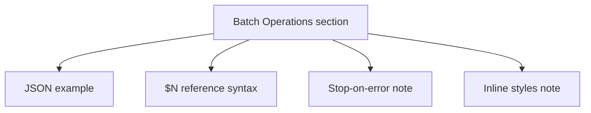

# Add a "Batch Operations" section under usage/tools with:

Batch Operations section in README.

```mermaid
flowchart TD
    A[Batch Operations section] --> B[JSON example]
    A --> C[$N reference syntax]
    A --> D[Stop-on-error note]
    A --> E[Inline styles note]
```
