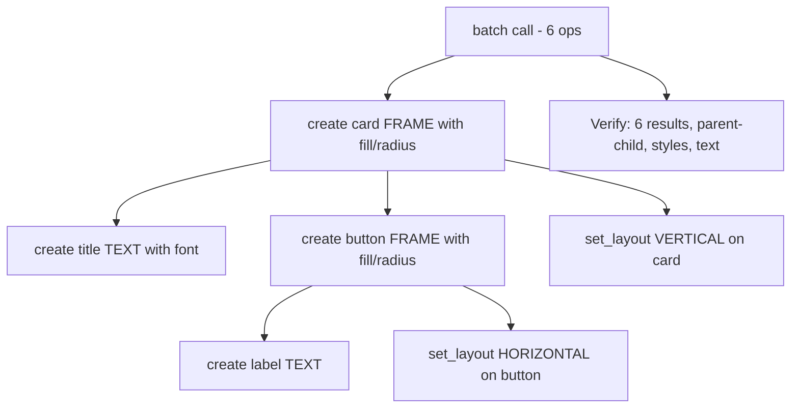

# Add an integration test to `tests/engine/batch.test.ts` (inside a `describe('batch integration')` block) that simulates a realistic mockup workflow. This test exercises inline styles from Task 00 within a batch from Task 01:

Integration test verifies full mockup workflow in a single batch call.

