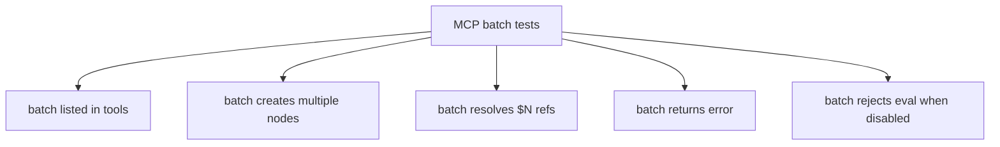

# Add tests to `tests/engine/mcp-server.test.ts` inside the existing `describe('MCP server')` block. Follow the existing pattern: use `client.callTool({ name: 'batch', arguments: { operations: [...] } })` and parse results with `parseResult()`. Each test must first call `new_document` to load a document.

5 batch MCP tests added to mcp-server.test.ts.

