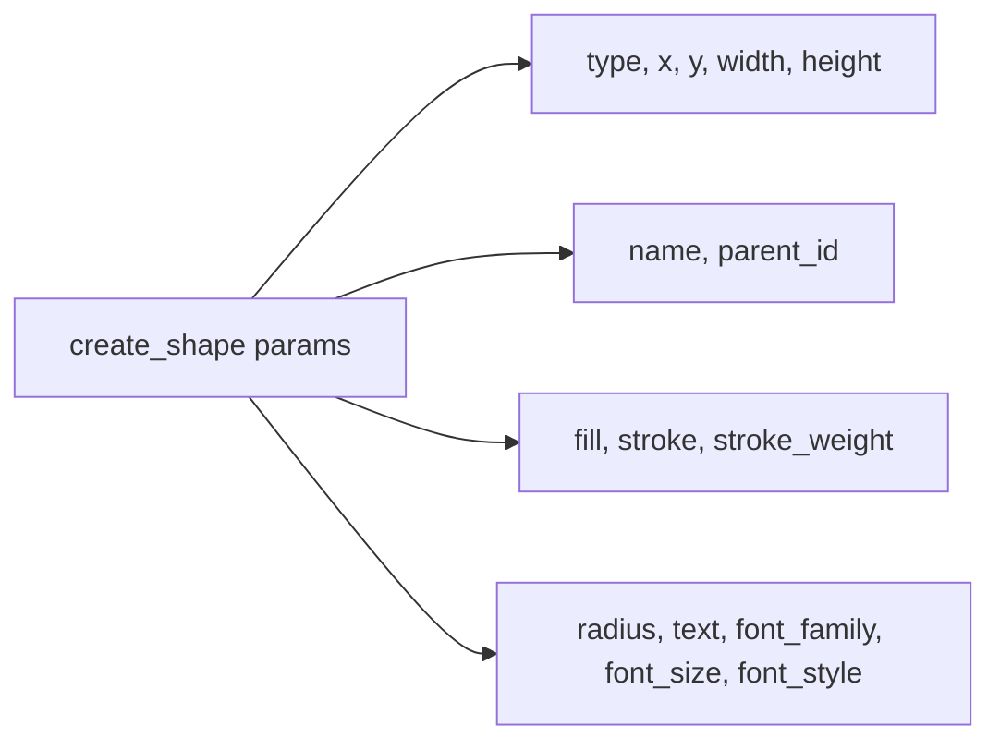

# Add the following optional params to `create_shape`'s `params` definition:

Inline style params (fill, stroke, stroke_weight, radius, text, font_family, font_size, font_style) added to create_shape's params definition.

