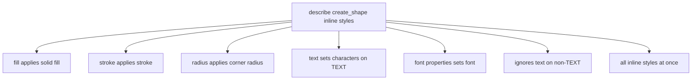

# Add the following test cases inside a `describe('create_shape inline styles')` block:

7 test cases in describe('create_shape inline styles') block covering fill, stroke, radius, text, font, ignore-on-non-TEXT, and combined styles.

