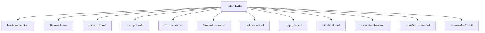

# Add the following test cases:

12 test cases covering all batch scenarios.

```mermaid
flowchart TD
    A[batch tests] --> B[basic execution]
    A --> C[$N resolution]
    A --> D[parent_id ref]
    A --> E[multiple refs]
    A --> F[stop on error]
    A --> G[forward ref error]
    A --> H[unknown tool]
    A --> I[empty batch]
    A --> J[disabled tool]
    A --> K[recursive blocked]
    A --> L[maxOps enforced]
    A --> M[resolveRefs unit]
```
