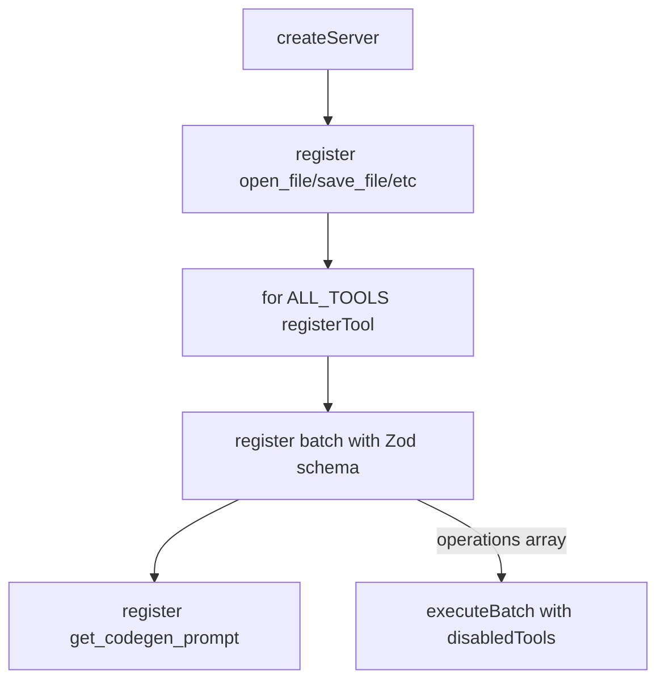

# After the `for (const tool of ALL_TOOLS) { registerTool(tool) }` loop (line 207 in server.ts), and BEFORE the `get_codegen_prompt` registration, add a custom registration for `batch`. The `register` variable (line 114) is `server.registerTool.bind(server)` and is already used for `open_file`, `save_file`, `new_document`, and `export_image_file`:

Batch tool registered in MCP server after ALL_TOOLS, before get_codegen_prompt.

