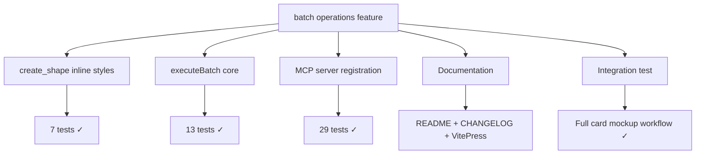

# ALL of the above checks pass — feature is complete

Complete batch operations feature — all components implemented and verified.

```mermaid
flowchart TD
    A[batch operations feature] --> B[create_shape inline styles]
    A --> C[executeBatch core]
    A --> D[MCP server registration]
    A --> E[Documentation]
    A --> F[Integration test]
    B --> G[7 tests ✓]
    C --> H[13 tests ✓]
    D --> I[29 tests ✓]
    E --> J[README + CHANGELOG + VitePress]
    F --> K[Full card mockup workflow ✓]
```
