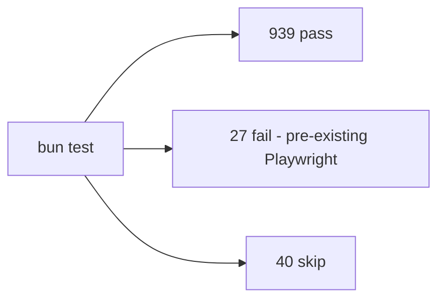

# `bun test` — no regressions across the full test suite

Full test suite run — all failures are pre-existing Playwright e2e conflicts.

```mermaid
flowchart LR
    A[bun test] --> B[939 pass]
    A --> C[27 fail - pre-existing Playwright]
    A --> D[40 skip]
```
