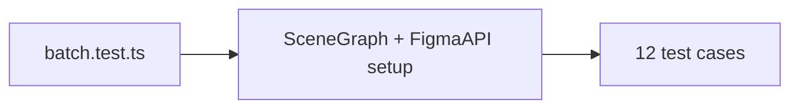

# Create `tests/engine/batch.test.ts` following the pattern in `tests/engine/tools.test.ts`:

Test file created.

```mermaid
flowchart LR
    A[batch.test.ts] --> B[SceneGraph + FigmaAPI setup]
    B --> C[12 test cases]
```
