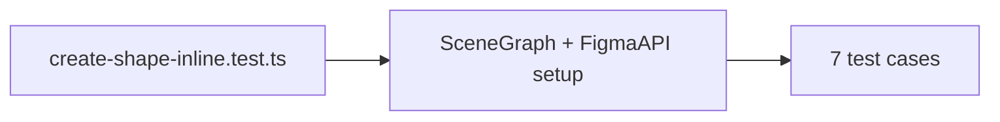

# Create `tests/engine/create-shape-inline.test.ts` following the pattern in `tests/engine/tools.test.ts`:

Test file created at tests/engine/create-shape-inline.test.ts with SceneGraph + FigmaAPI setup.

