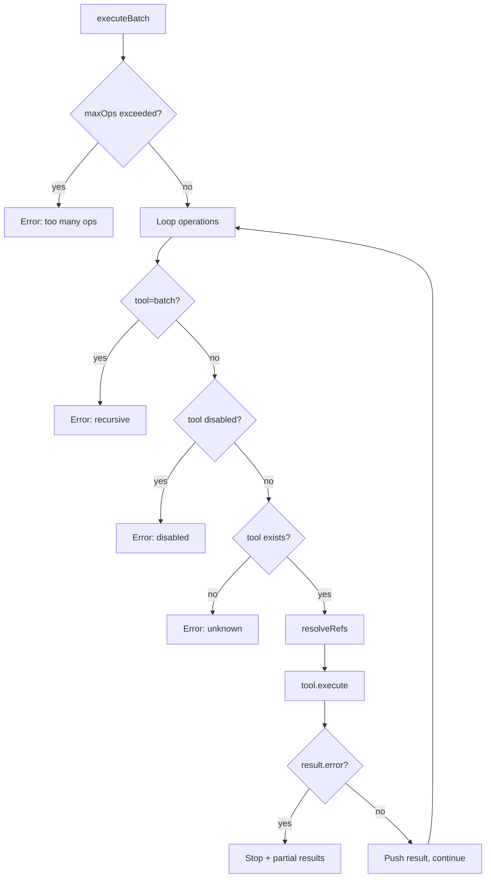

# Create the new file `packages/core/src/tools/batch.ts`

The batch tool dispatches operations to existing tools sequentially, resolving $N references between operations.

```mermaid
flowchart TD
    A[executeBatch] --> B{maxOps exceeded?}
    B -->|yes| C[Error: too many ops]
    B -->|no| D[Loop operations]
    D --> E{tool=batch?}
    E -->|yes| F[Error: recursive]
    E -->|no| G{tool disabled?}
    G -->|yes| H[Error: disabled]
    G -->|no| I{tool exists?}
    I -->|no| J[Error: unknown]
    I -->|yes| K[resolveRefs]
    K --> L[tool.execute]
    L --> M{result.error?}
    M -->|yes| N[Stop + partial results]
    M -->|no| O[Push result, continue]
    O --> D
```
