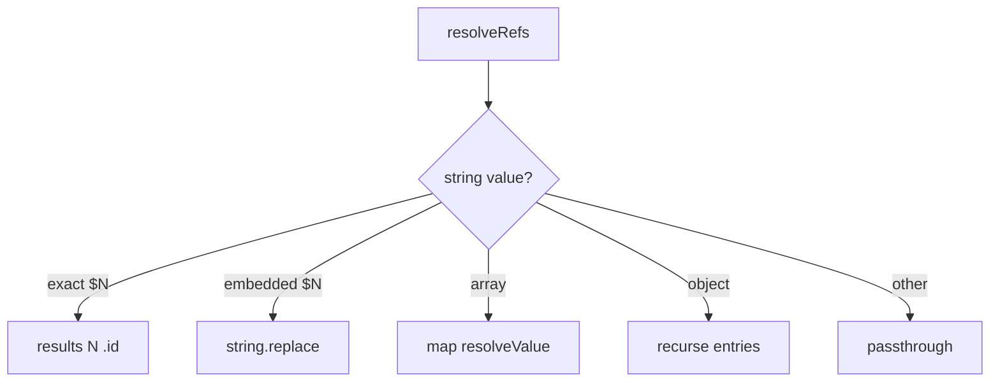

# Define a `resolveRefs` function that:

resolveRefs walks args recursively, replacing $N with results[N].id.

```mermaid
flowchart TD
    A[resolveRefs] --> B{string value?}
    B -->|exact $N| C[results N .id]
    B -->|embedded $N| D[string.replace]
    B -->|array| E[map resolveValue]
    B -->|object| F[recurse entries]
    B -->|other| G[passthrough]
```
