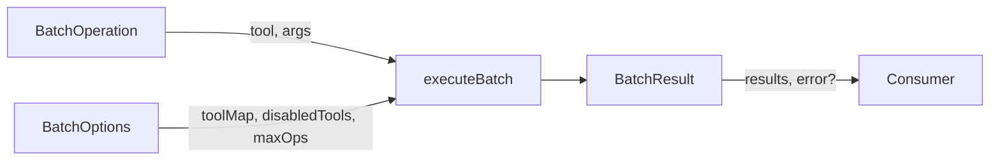

# Define the `batch` tool using the existing tool execute pattern (NOT `defineTool` — it will be registered manually in the MCP server due to complex schema):

Batch interfaces and executeBatch function.

