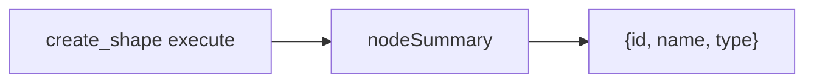

# Ensure the return value still uses `nodeSummary(node)` — no change to output format

Return value unchanged — nodeSummary(node) returns {id, name, type}.

```mermaid
flowchart LR
    A[create_shape execute] --> B[nodeSummary] --> C["{id, name, type}"]
```
