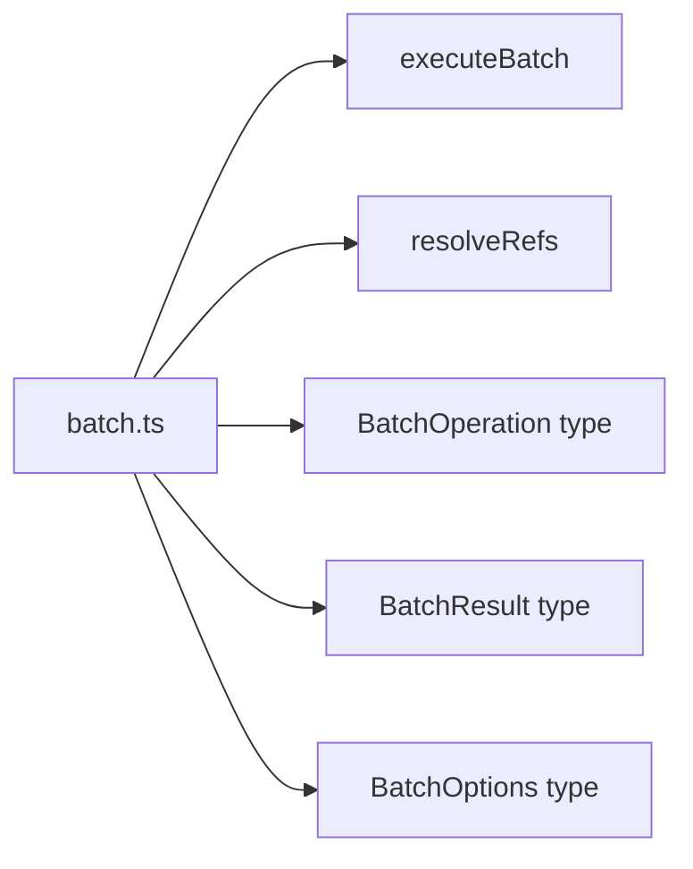

# Export `executeBatch`, `BatchOperation`, `BatchResult`, `BatchOptions`, and `resolveRefs` from the file

Exports from batch.ts.

```mermaid
flowchart LR
    A[batch.ts] --> B[executeBatch]
    A --> C[resolveRefs]
    A --> D[BatchOperation type]
    A --> E[BatchResult type]
    A --> F[BatchOptions type]
```
