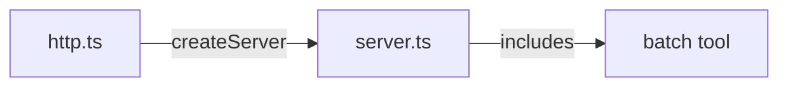

# `http.ts` calls `createServer(pkg.version, { enableEval: false, fileRoot })` at line 28 — since `batch` is registered inside `createServer()`, no changes are needed in `http.ts`. Just verify this by reading the file.

http.ts delegates to createServer which includes batch.

