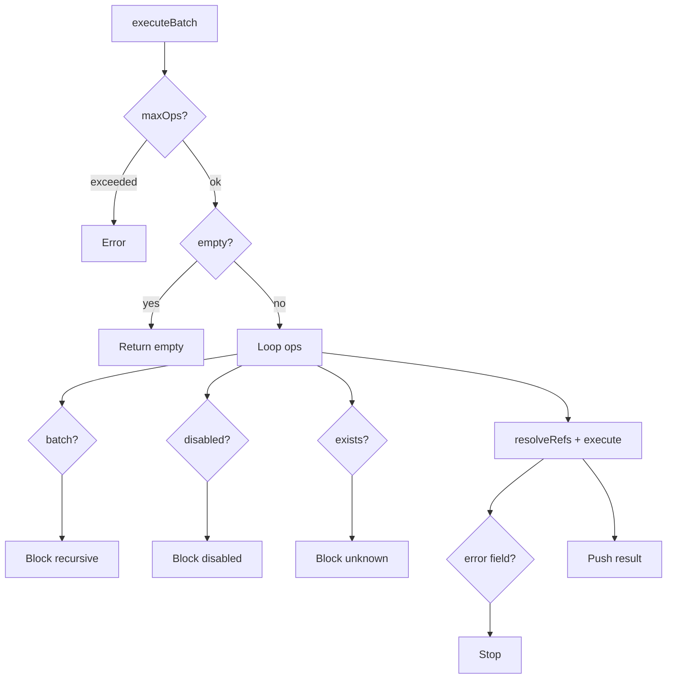

# Implement `executeBatch`:

executeBatch implementation with all safety guards.

```mermaid
flowchart TD
    A[executeBatch] --> B{maxOps?}
    B -->|exceeded| C[Error]
    B -->|ok| D{empty?}
    D -->|yes| E[Return empty]
    D -->|no| F[Loop ops]
    F --> G{batch?} --> H[Block recursive]
    F --> I{disabled?} --> J[Block disabled]
    F --> K{exists?} --> L[Block unknown]
    F --> M[resolveRefs + execute]
    M --> N{error field?} --> O[Stop]
    M --> P[Push result]
```
