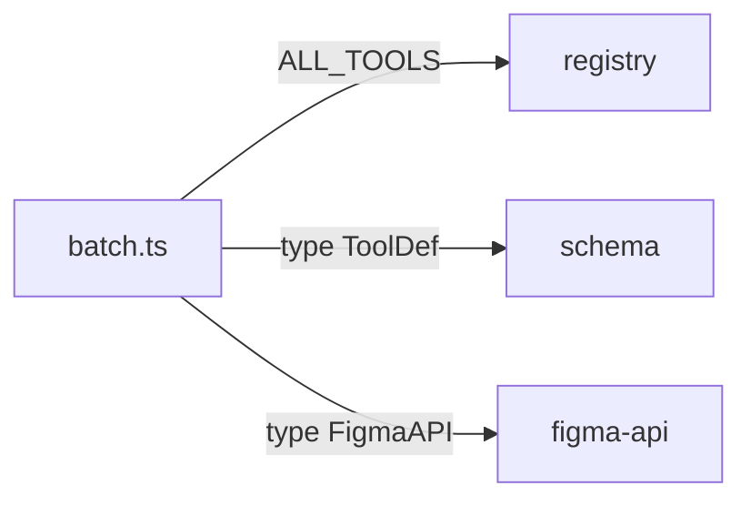

# Import `ALL_TOOLS` from `./registry`, and type-only imports: `type { ToolDef }` from `./schema` and `type { FigmaAPI }` from `../figma-api`. Do NOT import `defineTool` — `batch` is not registered via `defineTool` since it needs a custom Zod schema in the MCP server.

Imports in batch.ts.

