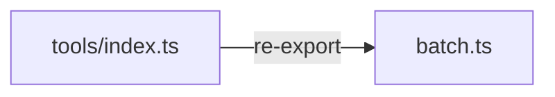

# In `packages/core/src/tools/index.ts`, add: `export { executeBatch, resolveRefs } from './batch'` and `export type { BatchOperation, BatchResult, BatchOptions } from './batch'`

Exports added to tools/index.ts.

