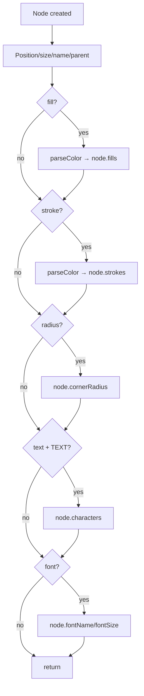

# In the `execute` function, after the existing node setup code (position, resize, name, parent — i.e. after `if (parent) parent.appendChild(node)`), add inline style application following the `create_vector` pattern already in the same file:

Inline style application logic in create_shape execute function, applied after node creation and parenting.

