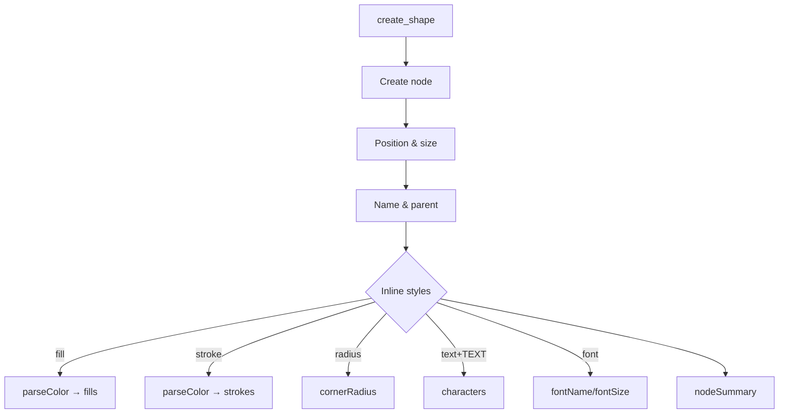

# Read `packages/core/src/tools/create.ts` to understand `create_shape` and `create_vector`

create_shape now accepts optional inline style properties (fill, stroke, radius, text, font), applied after node creation following the create_vector pattern.

