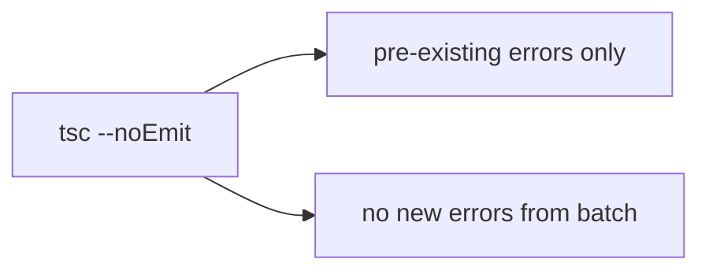

# Run `cd packages/core && npx tsc --noEmit` — no errors

TypeScript check — pre-existing errors only.

```mermaid
flowchart LR
    A[tsc --noEmit] --> B[pre-existing errors only]
    A --> C[no new errors from batch]
```
