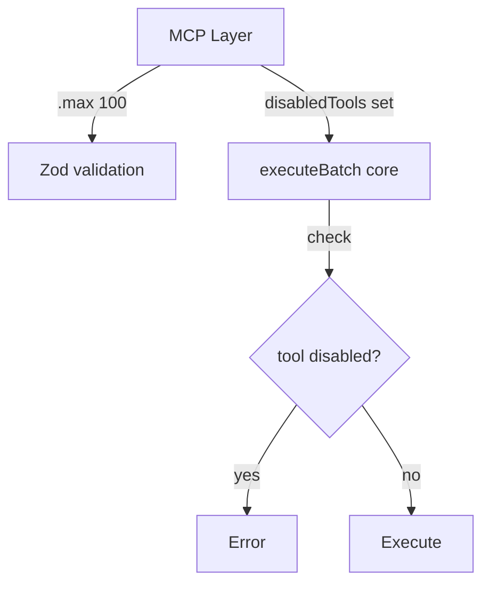

# The `eval` gate is enforced at two layers: (1) the Zod schema `.max(100)` limits batch size, (2) the `disabledTools` set passed to `executeBatch` blocks `eval` (and any future restricted tools) at the core layer. This defense-in-depth prevents bypass if `executeBatch` is called outside the MCP server.

Defense-in-depth: Zod schema max + core disabledTools.

