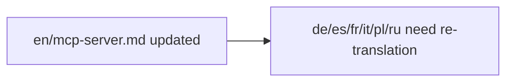

# Update the localized copies (`de/`, `es/`, `fr/`) if they already document individual tools — if they are auto-generated translations, skip them and note that they need re-translation

Localized docs skipped — auto-generated translations.

