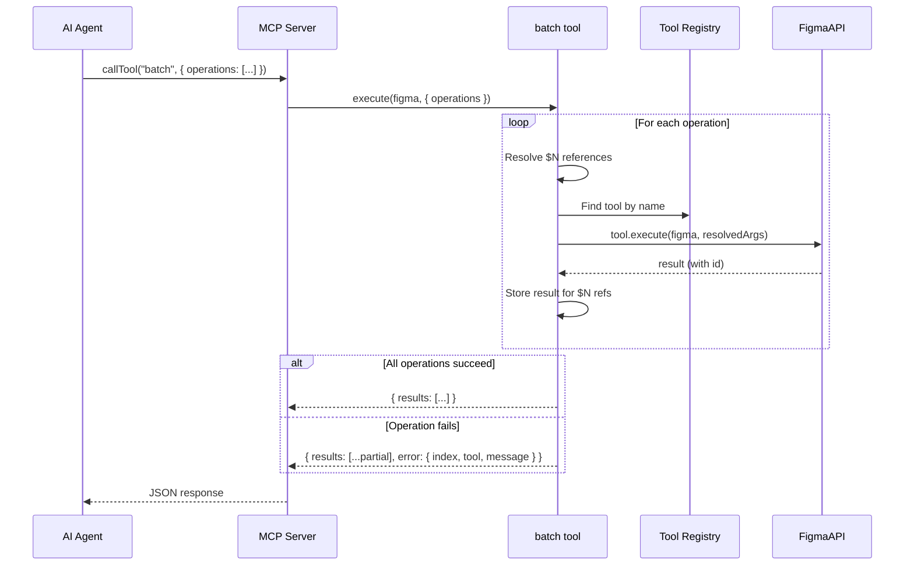

# Architecture: Batch Operations API

## Overview

The batch operations feature adds two capabilities to the OpenPencil tool system:

1. A `batch` meta-tool that dispatches to existing tools sequentially
2. Inline style properties on `create_shape` (following the `create_vector` pattern)

Both integrate into the existing `defineTool` / `ALL_TOOLS` / `registerTool` architecture with minimal new code.

## Architecture



## Key Technical Decisions

### 1. Meta-tool dispatching to existing tools

The `batch` tool looks up tools by name from `ALL_TOOLS` and calls their `execute()` function directly. This means:
- Every existing tool is automatically batchable
- No code duplication
- All existing validation and error handling is reused
- New tools added in the future are automatically supported

```ts
// Simplified batch execution loop (see batch.ts for full implementation)
export async function executeBatch(
  figma: FigmaAPI,
  operations: BatchOperation[],
  options?: BatchOptions  // { toolMap?, disabledTools?, maxOperations? }
): Promise<BatchResult>

// Core loop:
const toolMap = options?.toolMap ?? new Map(ALL_TOOLS.map(t => [t.name, t]))
for (const op of operations) {
  if (options?.disabledTools?.has(op.tool)) return error(...)
  const tool = toolMap.get(op.tool)
  const args = resolveRefs(op.args, results)
  const result = await tool.execute(figma, args)
  if (result?.error) return { results, error: { index, tool: op.tool, message: result.error } }
  results.push(result)
}
```

### 2. `$N` reference resolution

References like `$0`, `$1` in string values are replaced with the `id` field from the Nth operation's result. Resolution is recursive through all string values in the args object.

- `"$0"` → `results[0].id` (exact match, full replacement)
- `"prefix-$0-suffix"` → `"prefix-abc123-suffix"` (embedded, string interpolation)
- References to future operations are errors (forward references not allowed)
- References to failed operations are errors (operation never produced a result)

### 3. Inline styles on `create_shape`

Following the pattern already established by `create_vector` (which accepts `fill`, `stroke`, `stroke_weight`), `create_shape` gains optional style params:

| Param | Type | Description |
|-------|------|-------------|
| `fill` | color | Fill color (hex) |
| `stroke` | color | Stroke color (hex) |
| `stroke_weight` | number | Stroke weight |
| `radius` | number | Corner radius |
| `text` | string | Text content (TEXT nodes only) |
| `font_family` | string | Font family |
| `font_size` | number | Font size |
| `font_style` | string | Font style (e.g., "Bold") |

These are applied after node creation, in the same `execute()` call. This reduces a typical "create styled button" from 4-5 calls to 1.

### 4. Error handling: stop-on-first-error

Design operations typically cascade (create parent → create child → style child). If operation 2 fails, operations 3+ that reference `$2` would also fail. Stopping immediately and returning partial results is the safest strategy.

Response format:
```json
{
  "results": [
    { "id": "abc", "name": "Card", "type": "FRAME" },
    { "id": "def", "name": "Title", "type": "TEXT" }
  ],
  "error": {
    "index": 2,
    "tool": "set_fill",
    "message": "Node \"xyz\" not found"
  }
}
```

### 5. MCP server registration

The `batch` tool requires a custom Zod schema in the MCP server because its `operations` param is an array of objects (not supported by the generic `paramToZod` converter). It will be registered separately in `server.ts`, similar to how `open_file`, `save_file`, and `export_image_file` are registered.

## Security Considerations

- The `batch` tool only dispatches to tools in `ALL_TOOLS` — no arbitrary code execution
- If `eval` is disabled via `enableEval: false`, `batch` operations referencing `eval` are rejected. This is enforced at **two layers**: (1) the MCP server passes a `disabledTools` set to `executeBatch`, and (2) `executeBatch` checks `disabledTools` before dispatching each operation. Defense-in-depth prevents bypass if `executeBatch` is called outside the MCP server.
- `$N` references are validated (bounds checking, type checking) — they resolve only to `.id` fields from prior results (system-generated node IDs), preventing injection
- Recursive `batch` calls are blocked — `executeBatch` rejects `tool: "batch"` to prevent infinite loops
- Batch size is capped at 100 operations (Zod schema `.max(100)` + `maxOperations` in core) to prevent denial-of-service
- Server-only tools (`open_file`, `save_file`, `new_document`, `export_image_file`) are NOT in `ALL_TOOLS` and therefore cannot be dispatched via batch — this is an intentional security boundary. The `toolMap` parameter of `executeBatch` must never be populated with server-only tools that have their own authorization logic (e.g., `resolveAndCheckPath` file sandboxing).
- No new file I/O paths — all file access goes through existing tools